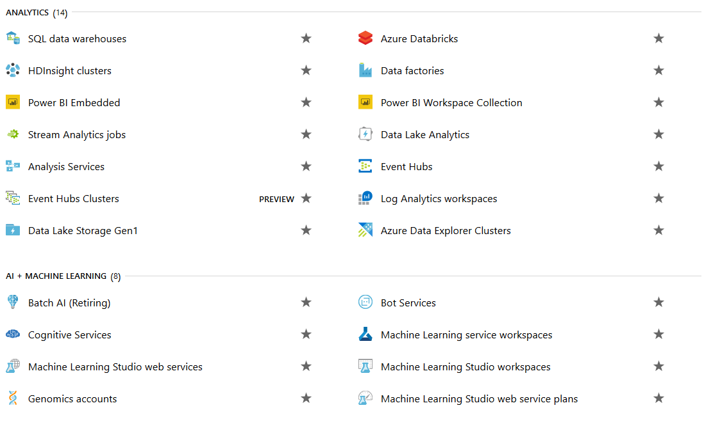

# Chapter 1: Define and prepare the development environment

## Certification Objectives covered

- Select development environment
May include but is not limited to: Assess the deployment environment constraints, analyze and recommend tools that meet system requirements, select the development environment

- Set up development environment
 May include but is not limited to: Create an Azure data science environment, configure data science work environments
 [Azure Data Science Virtual Machines](https://azure.microsoft.com/en-us/services/virtual-machines/data-science-virtual-machines )

- Quantify the business problem
May include but is not limited to: Define technical success metrics, quantify risks

# A word of caution

At first glance, this certification objectives look out of order.
Why? because it makes more sense to quantify the business problem first, and then choose the tools (aka. development environment) that you will use for tacking the problem

# Quantify the Business Problem

A good start is taking a look at the [CRISP-DM](https://en.wikipedia.org/wiki/Cross-industry_standard_process_for_data_mining) methodology.
CRISP-DM starts with a "Understand the business problem" phase.
There is some stuff to take into account: 
- What kind of problem we want to solve?
- What's the current status? (the prior) Maybe this problem happens 1% of the time.
- What's the impact on the business? Try to put a money amount on the event. For instance, that 1% event might cost $1000s to the company.

# Select development environment

Selecting Azure development environment is not an easy task.

Given this plethora of services... what can you do to get choose what suits best?

First, if there is an API for your problem, use that API (Image, text-to-speech, speet to text, etc.=
If there is no API, we still have options:)

Environment 1: Machine Learning Studio

Environment 2: Machine Learning VM

Environment 3: Custom

# Setup development environment